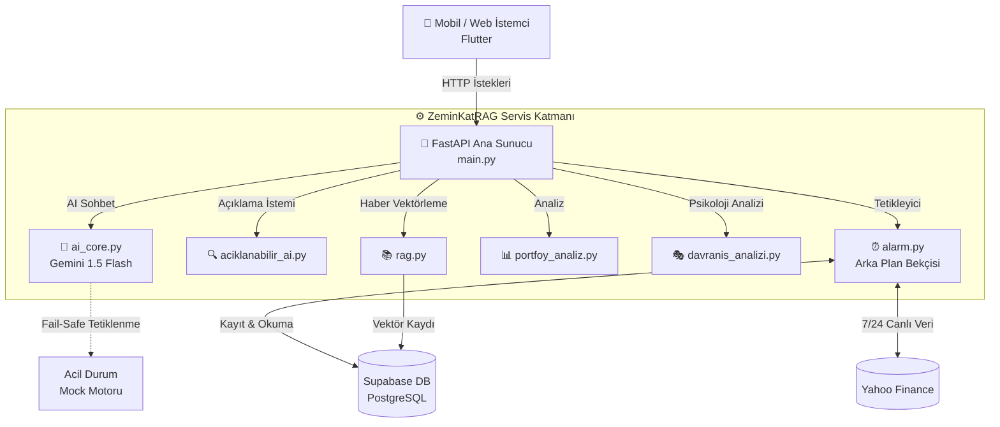

# 📈 ZeminKatRAG (CüzdanRAG) - AI-Powered Financial Portfolio & Coach API


ZeminKatRAG, bireysel yatırımcılar için geliştirilmiş, yapay zeka destekli, otonom bir finansal koç ve portföy yönetim arka plan (backend) servisidir. Gelişmiş RAG (Retrieval-Augmented Generation) mimarisi ile güncel piyasa haberlerini analiz eder, 7/24 çalışan asenkron motorlarla fiyat alarmlarını takip eder ve Explainable AI (XAI) ile yatırım tavsiyelerinin mantıksal dayanaklarını şeffaf bir şekilde kullanıcıya sunar.

Mobil ve web arayüzleri (Frontend) ile tam uyumlu çalışacak şekilde RESTful standartlarında tasarlanmıştır.

---

## ✨ Öne Çıkan Mühendislik Özellikleri

- **🧠 RAG Destekli Yapay Zeka Koçu:** Gemini 1.5 Flash entegrasyonu ile kullanıcının risk profiline ve portföy özetine göre kişiselleştirilmiş, gerçek piyasa verilerine dayalı tavsiyeler üretir.
- **🛡️ Fail-Safe (Hata Toleranslı) API Mimarisi:** AI API'lerinde yaşanabilecek 503 (High Demand) veya 429 (Rate Limit) hatalarına karşı otomatik yedek API anahtarına geçen ve sistemin çökmesini engelleyen (Mock Response) güvenli katman.
- **⚙️ Asenkron Arka Plan Bekçisi (Background Worker):** `asyncio` ve `yfinance` kullanılarak, ana API trafiğini asla kilitlemeden 7/24 canlı fiyat takibi yapan ve Supabase üzerinden akıllı alarm tetikleyen otonom döngü.
- **🔍 Explainable AI (XAI) Entegrasyonu:** Kullanıcıya sadece "Al/Sat" demez, bu kararın arkasındaki Risk Uyumu, Vade Analizi ve Piyasa Dayanağını JSON formatında ayrıştırarak açıklar.
- **📊 Davranışsal Finans (Bias) Dedektörü:** Kullanıcının işlem geçmişini analiz ederek FOMO (Fırsatı Kaçırma Korkusu) veya Panik Satışı gibi psikolojik zaafları tespit eder.

---

## 🛠️ Teknoloji Yığını (Tech Stack)

* **Framework:** FastAPI (Yüksek performanslı, asenkron REST API)
* **Yapay Zeka:** Google Gemini API (gemini-1.5-flash)
* **Veritabanı:** Supabase (PostgreSQL tabanlı, gerçek zamanlı DB)
* **Finansal Veri Sağlayıcı:** `yfinance` (Yahoo Finance)
* **Bağımlılık Yönetimi:** Uvicorn, Pydantic, python-dotenv

---

## ⚙️ Kurulum & Çalıştırma (Local Development)

Projeyi kendi ortamınızda ayağa kaldırmak için aşağıdaki adımları izleyin:

1. Projeyi Klonlayın:
    ```bash
    git clone [https://github.com/efeyigitaltun/zeminkatrag-backend.git](https://github.com/efeyigitaltun/zeminkatrag-backend.git)
    cd zeminkatrag-backend

2.Sanal Ortam (Virtual Environment) Oluşturun:
    
     python -m venv venv
     # Windows için:
     venv\Scripts\activate
     # MacOS/Linux için:
     source venv/bin/activate

3. Gerekli Paketleri Yükleyin:
   ```bash
        pip install -r requirements.txt

4. Çevre Değişkenlerini Ayarlayın:
   ```bash
   SUPABASE_URL=[https://xxxxxxxxxxxx.supabase.co](https://xxxxxxxxxxxx.supabase.co)
      SUPABASE_KEY=eyJhbGciOiJIUzI1NiIsIn...
      GEMINI_API_KEY_ANA=AIzaSy...
      GEMINI_API_KEY_YEDEK=AIzaSy...

5. Sunucuyu Başlatın:
   ```bash
    uvicorn main:app --reload


API başarılı bir şekilde başladığında http://127.0.0.1:8000 adresinde çalışıyor olacaktır. Otomatik dökümantasyon (Swagger UI) için http://127.0.0.1:8000/docs adresini ziyaret edebilirsiniz.

PROJE MİMARİSİ

    
 Temel API Endpoint'leri
 
 | 🟢 Metot | 📍 Endpoint | 📝 Açıklama |
| :---: | :--- | :--- |
| **`POST`** | `/api/chat` | 🧠 **Yapay Zeka Koçu:** Kullanıcı sorularını ve risk profilini alıp portföy tavsiyesi üretir. |
| **`POST`** | `/api/alarm/kur` | ⏰ **Akıllı Alarm:** Supabase'e hedef fiyatı yazar, arka plan bekçisi 7/24 takip eder. |
| **`POST`** | `/api/analiz/neden` | 🔍 **XAI (Şeffaf AI):** Önerilen bir varlığın arkasındaki risk, vade ve piyasa analizini JSON olarak ayrıştırır. |
| **`POST`** | `/api/portfoy/davranis` | 🎭 **Bias Dedektörü:** İşlem geçmişine bakarak yatırımcının psikolojik hatalarını (FOMO, Panik) tespit eder. |
| **`POST`** | `/api/vergi_maliyet` | 💰 **Maliyet Optimizasyonu:** Alım/Satım işlemleri için vergi yükü ve kesinti hesaplamalarını yapar. |
| **`GET`** | `/api/fiyat/{sembol}` | 📈 **Canlı Fiyat:** Yfinance motorunu kullanarak hisse/kripto fiyatını anlık getirir. |


## 🤝 Geliştirici Ekip
Bu proje [BTK Hackathon 2026] kapsamında geliştirilmiştir.
* **[Efe Yiğit ALTUN](https://github.com/efeyigitaltun)** - Backend & AI Architecture (Python / FastAPI)
* **[Osman BABAYİĞİT](https://github.com/osmanbabayigit)** - Frontend & UI/UX (Flutter)
